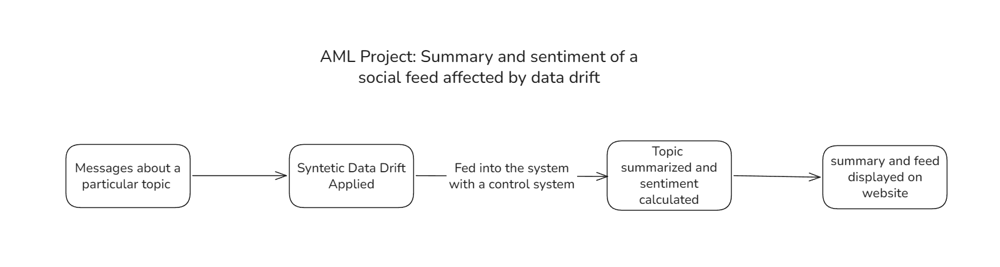

# StreamSense ⚡
> **Real-time Social Feed Summarization & Sentiment Analysis under Synthetic Semantic Data Drift**  
> *Advanced Machine Learning (AML) Project — Sem 7*



---

## 🌟 Project Highlights & AML Contributions

StreamSense investigates how modern Natural Language Processing (NLP) models perform when deployed on streaming social feeds subject to **concept drift** and **semantic data drift**.

### 1. Dual-Component System Architecture
- **Control System & Synthetic Drift Engine**: A dynamic control panel providing fine-grained parametric control over data streams, drift velocity, and multiple textual corruption/drift strategies.
- **Streaming Social Feed Processor & Evaluator**: Consumes incoming text streams under a dual-trigger windowing strategy ($N$ messages or $T$ seconds timeout, whichever occurs first) and monitors statistical divergence in real-time.

### 2. Academically Grounded Drift Methodologies
Incorporates drift generation paradigms from [Garcia et al. (2024), *Methods for Generating Drift in Text Streams*, arXiv:2403.12328](https://arxiv.org/abs/2403.12328), combined with custom NLP perturbations:

| Drift Method | Taxonomy | Description | Practical Real-World Phenomenon |
|---|---|---|---|
| **Adjective Swap** | Semantic / WordNet | Tokenizes text, POS-tags adjectives (`JJ`, `JJR`, `JJS`), and swaps them with WordNet antonyms. | Semantic shift & opinion reversal |
| **Class Swap** | Abrupt Label Drift | Inverts rating scales ($1\star \leftrightarrow 5\star$, $2\star \leftrightarrow 4\star$, $3\star \text{ unchanged}$). | Sudden platform guideline recalibration |
| **Class Shift** | Gradual Label Drift | Cyclically shifts rating classes ($1 \to 2 \to 3 \to 4 \to 5 \to 1$). | Gradual score inflation / drift |
| **Formality & Slang Shift** | Register Transformation | Replaces formal vocabulary with internet slang, abbreviations, and informal phrasing. | Generational/demographic community shifts |
| **Noise & Typo Injection** | Syntactic Perturbation | Simulates keyboard adjacency typos, missing characters, transpositions, and truncation. | Bot traffic, noisy mobile keyboards |
| **Time-Slice Removal** | Temporal Discontinuity | Simulates missing historical windows in stream mining. | System outages, missing data epochs |

### 3. Real-Time Drift Metrics
- **TF-IDF Cosine Distance**: Measures distribution shift in high-dimensional term space.
- **Vocabulary Jaccard Overlap**: Quantifies the rate of novel/unseen vocabulary.
- **Sentiment KL-Divergence**: Measures relative entropy between original and drifted sentiment distributions.
- **Composite Drift Magnitude (%)**: Weighted composite metric indicating net perturbation severity.

---

## 📊 Dataset: Stanford SNAP Amazon Movie Reviews
- **Source**: [Stanford SNAP Amazon Movie Reviews](https://snap.stanford.edu/data/web-Movies.html) (~8 million reviews)
- **Top Product Extracted**: `B002QZ1RS6` (*Beachbody INSANITY Series* — 957 detailed long-form reviews)
- **Hidden Ground Truth**: Review star ratings ($1.0 - 5.0\star$) are stripped from the downstream consumer feed and preserved internally to measure accuracy degradation over time.

---

## 🚀 Quick Start Guide

### 1. Install Dependencies
```bash
pip install -r requirements.txt
```

### 2. (Optional) Re-extract Dataset Subset
```bash
python scripts/create_subset.py
```

### 3. Run Unit Tests
```bash
python -m unittest tests/test_drift_engine.py
```

### 4. Launch StreamSense
```bash
python -m uvicorn src.main:app --host 127.0.0.1 --port 8000 --reload
```
Open **[http://127.0.0.1:8000](http://127.0.0.1:8000)** in your browser to access the interactive Control System & Real-Time Analytics Dashboard.

---

## 📁 Repository Structure
```
Project/
├── control_panel/              # Frontend Dashboard
│   ├── index.html              # Dark glassmorphic interface
│   ├── style.css               # Modern styling & animations
│   └── app.js                  # WebSocket client & Chart.js visualizations
├── data/
│   ├── dataset_meta.json       # Extracted product metadata & score distribution
│   ├── sample_reviews.csv      # Rapid development sample (500 reviews)
│   └── top_movie_reviews.csv   # Full review stream for top movie (957 reviews)
├── scripts/
│   └── create_subset.py        # Ultra-fast, memory-safe two-pass 9.3GB stream parser
├── src/
│   ├── config.py               # Pydantic schemas & configuration
│   ├── data_loader.py          # Sequential review stream manager
│   ├── drift_engine.py         # 6 Textual & semantic drift generator methods
│   ├── drift_metrics.py        # Real-time cosine, KL-div, and overlap calculators
│   ├── feed_simulator.py       # Dual-trigger async window streaming simulator
│   └── main.py                 # FastAPI backend & WebSocket endpoints
├── tests/
│   └── test_drift_engine.py    # Automated test suite
├── requirements.txt            # Python dependencies
└── ReadMe.md                   # Project documentation
```

---

## 📚 References
- Garcia, C. M., Koerich, A. L., de Souza Britto Jr, A., & Barddal, J. P. (2024). *Methods for Generating Drift in Text Streams*. [arXiv:2403.12328](https://arxiv.org/abs/2403.12328).
- McAuley, J., & Leskovec, J. (2013). *From amateurs to connoisseurs: modeling the evolution of user expertise through online reviews*. WWW 2013.